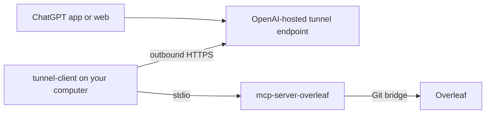

# Connect ChatGPT to Overleaf with Secure MCP Tunnel

This guide uses a source checkout. An npm installation can use the same stdio transport:
see [Install from npm](../README.md#install-from-npm), keep configuration outside the npx
cache, and use the pinned npm command as the local server command in your wrapper.

This guide connects ChatGPT to a private, local instance of `mcp-server-overleaf` without
publishing an MCP endpoint or opening an inbound firewall port. It uses OpenAI Secure MCP
Tunnel to carry MCP requests from ChatGPT to a `tunnel-client` process on your computer,
which starts this server over stdio.



The ChatGPT connection is stored in the selected ChatGPT workspace. Once it is configured,
it can be used from both ChatGPT on the web and the desktop app while the local tunnel
runtime is online.

The OpenAI documentation for the underlying feature is the
[Secure MCP Tunnel guide](https://developers.openai.com/api/docs/guides/secure-mcp-tunnels).

## Prerequisites

You need:

- macOS or another machine that can run `tunnel-client`, Node.js 20 or newer, and Git;
- an Overleaf account with working Git integration;
- an Overleaf Git authentication token and at least one 24-character project ID;
- access to an OpenAI Platform organization with `Tunnels: Read + Manage` while creating
  the tunnel;
- `Tunnels: Read + Use` for the person or service account that creates the runtime key;
- permission to enable developer mode in the target ChatGPT workspace; and
- outbound HTTPS access to `api.openai.com:443` from the machine running the tunnel.

Platform tunnel permissions and ChatGPT developer-mode permission are separate. Having one
does not grant the other.

## 1. Build and configure the Overleaf MCP server

From this repository:

```bash
npm install
npm run build
test -f dist/index.js
```

Create the local environment file and restrict its permissions:

```bash
cp .env.example .env
chmod 600 .env
```

Edit `.env` locally. Do not paste either token into ChatGPT or place it directly in a shell
command that will be saved in shell history.

```dotenv
OVERLEAF_GIT_TOKEN=olp_your_token
OVERLEAF_PROJECTS=paper=64a1b2c3d4e5f6a7b8c9d0e1
OVERLEAF_DEFAULT_PROJECT=paper
```

Verify the Overleaf credential before introducing the tunnel:

```bash
git ls-remote https://git@git.overleaf.com/64a1b2c3d4e5f6a7b8c9d0e1
```

When Git asks for a password, enter the Overleaf Git token. Printed refs confirm that the
token, project ID, and Overleaf plan work together. Resolve a `403` or `Repository not
found` response before continuing.

Start the stdio server once as a local smoke test:

```bash
npm run start:stdio
```

The process should remain running and print `mcp-server-overleaf: listening on stdio` to
stderr. Stop it with <kbd>Ctrl</kbd>+<kbd>C</kbd>. The tunnel will start its own instance.

## 2. Install `tunnel-client`

Download the build for your operating system from
[Platform tunnel settings](https://platform.openai.com/settings/organization/tunnels) or
the latest public [`openai/tunnel-client` release](https://github.com/openai/tunnel-client/releases/latest).
Use the latest release rather than copying a version-specific URL from this guide.

For example, after downloading the macOS binary:

```bash
mkdir -p "$HOME/.local/bin"
install -m 0755 ./tunnel-client "$HOME/.local/bin/tunnel-client"
export PATH="$HOME/.local/bin:$PATH"
tunnel-client help quickstart
```

Add `$HOME/.local/bin` to your shell's `PATH` if it is not already there.

## 3. Confirm the OpenAI account, organization, and workspace

Do this before creating a tunnel. Most “tunnel not visible” failures are identity or scope
failures rather than local networking failures.

1. In ChatGPT, switch to the workspace where the Overleaf app should be available.
2. Confirm which OpenAI account owns that workspace.
3. In the Platform dashboard, sign in with the corresponding account and select the intended
   Platform organization.
4. When creating or editing a tunnel, confirm that the target ChatGPT workspace appears as
   an association option.

Do not assume that a Platform personal organization and a ChatGPT Business, Enterprise, or
Edu workspace are automatically associated. If the target workspace is absent, correct the
account or organization selection first. If an enterprise association cannot be verified
automatically, the workspace administrator may need an OpenAI account-team association
override.

## 4. Create the Secure MCP Tunnel

Open [Platform tunnel settings](https://platform.openai.com/settings/organization/tunnels)
under the correct Platform organization and create a tunnel.

Suggested values:

| Field | Value |
| --- | --- |
| Name | `Overleaf Local` |
| Description | `Private tunnel to the local Overleaf MCP stdio service.` |
| Platform organization | The organization that will own and operate this tunnel |
| ChatGPT workspace | The workspace selected in step 3 |

Save the returned `tunnel_id`, which looks like
`tunnel_0123456789abcdef0123456789abcdef`. A tunnel associated only with a Platform
organization will not necessarily appear in a separate ChatGPT workspace.

## 5. Create a least-privilege runtime API key

In the same Platform organization, open
[Organization API keys](https://platform.openai.com/settings/organization/api-keys) and
create a restricted runtime key.

Grant only:

- `Tunnels: Read`
- `Tunnels: Use`

The long-running tunnel process does not need `Tunnels: Manage` and should never use an
OpenAI admin key.

Store the new key in a local file without putting the secret in the command itself:

```bash
mkdir -p "$HOME/.config/openai-tunnel"
chmod 700 "$HOME/.config/openai-tunnel"
umask 077
${EDITOR:-nano} "$HOME/.config/openai-tunnel/overleaf-runtime-api-key"
chmod 600 "$HOME/.config/openai-tunnel/overleaf-runtime-api-key"
```

Paste only the runtime key into that file, save it, close the editor, and clear the
clipboard. The key must come from the same Platform organization that owns or is associated
with the tunnel.

## 6. Give the tunnel a stable stdio command

Use a small wrapper so the tunnel profile contains one absolute executable path and works
even when the repository path contains spaces. Replace `/absolute/path/to/...` below with
the actual repository path.

```bash
mkdir -p "$HOME/.local/share/overleaf-tunnel"
cat > "$HOME/.local/share/overleaf-tunnel/start-overleaf-stdio.sh" <<'SH'
#!/bin/sh
set -eu
exec /usr/bin/env node "/absolute/path/to/mcp-server-overleaf/dist/index.js" --stdio
SH
chmod 700 "$HOME/.local/share/overleaf-tunnel/start-overleaf-stdio.sh"
```

Run the wrapper manually once. It should print the stdio listening message and stay alive:

```bash
"$HOME/.local/share/overleaf-tunnel/start-overleaf-stdio.sh"
```

Stop it with <kbd>Ctrl</kbd>+<kbd>C</kbd>.

## 7. Create and validate the tunnel profile

Put the tunnel ID in an environment variable. The ID is an identifier, not a secret:

```bash
export OVERLEAF_TUNNEL_ID="tunnel_0123456789abcdef0123456789abcdef"
```

Create a named stdio profile:

```bash
tunnel-client init \
  --sample sample_mcp_stdio_local \
  --profile overleaf-local \
  --tunnel-id "$OVERLEAF_TUNNEL_ID" \
  --mcp-command "$HOME/.local/share/overleaf-tunnel/start-overleaf-stdio.sh" \
  --control-plane-api-key-ref "file:$HOME/.config/openai-tunnel/overleaf-runtime-api-key" \
  --health-listen-addr 127.0.0.1:0
```

Validate the profile and its dependencies:

```bash
tunnel-client doctor --profile overleaf-local --explain
```

Fix every reported failure. A skipped network probe for a stdio target is expected; an
invalid API key, missing command, or failed control-plane lookup is not.

## 8. Start the tunnel runtime

For an initial test, keep the process attached to a terminal:

```bash
tunnel-client run --profile overleaf-local
```

Keep that terminal open. The startup output includes local `/healthz`, `/readyz`, and `/ui`
addresses. Confirm that readiness reports `ready` before opening ChatGPT.

For a runtime managed by `tunnel-client`, use the native runtime supervisor:

```bash
tunnel-client runtimes connect \
  --alias overleaf-local \
  --profile overleaf-local \
  --tunnel-id "$OVERLEAF_TUNNEL_ID" \
  --runtime-api-key "file:$HOME/.config/openai-tunnel/overleaf-runtime-api-key" \
  --mcp-command "$HOME/.local/share/overleaf-tunnel/start-overleaf-stdio.sh"

tunnel-client runtimes status overleaf-local --json
```

Do not treat “process started” as a complete check. The JSON status should show:

```json
{
  "process_running": true,
  "healthy": true,
  "ready": true,
  "runtime_state": "ready",
  "remote_error": ""
}
```

Also confirm that `remote.id` matches the tunnel ID and that `remote.workspace_ids` contains
the intended ChatGPT workspace. A managed local runtime still needs to be started again
after a machine reboot unless you add an operating-system service.

### Networks that require a proxy

If this machine reaches OpenAI through Clash or another HTTPS proxy, start
`tunnel-client` with the proxy variables in the same process environment:

```bash
export HTTPS_PROXY="http://127.0.0.1:7890"
export HTTP_PROXY="$HTTPS_PROXY"
export ALL_PROXY="$HTTPS_PROXY"
tunnel-client run --profile overleaf-local
```

Adjust the address for your proxy. A GUI system proxy may not be inherited reliably by a
background runtime, so persist these variables in the service or launcher that starts the
tunnel. Do not put the runtime API key in the proxy configuration.

## 9. Create the ChatGPT developer-mode app

Leave the tunnel runtime online while creating and testing the app.

1. Open ChatGPT and switch to the target workspace.
2. Open **Settings → Security and login** and enable **Developer mode**. If the control is
   unavailable, ask the workspace administrator to grant developer-mode access.
3. Open the ChatGPT Plugins or Connectors settings and choose the plus button to create a
   developer-mode app.
4. Set the name to `Overleaf Local` and add a clear description.
5. Under **Connection**, choose **Tunnel**.
6. Select the tunnel created in step 4. Paste its `tunnel_id` if the UI offers an ID field.
7. Choose **No Auth** for this server. The Overleaf token stays in the local `.env`; ChatGPT
   does not authenticate directly to Overleaf.
8. Review the risk acknowledgement, create the app, and connect it to the workspace.

ChatGPT should discover 16 tools. If the tunnel is absent from the selector, return to
steps 3–5 instead of creating a second tunnel immediately.

## 10. Verify the complete path with read-only calls

Start with an explicit read-only prompt:

> Use only the `list_projects` tool from the Overleaf Local app. Do not call any editing,
> syncing, compiling, discarding, or pushing tool. Show me the configured project names and
> which one is the default.

Confirm that ChatGPT displays a tool call to `Overleaf Local` and returns the configured
project. Then test `list_files` on that project.

These two calls prove the full path:

1. ChatGPT found the developer-mode app.
2. The app reached the OpenAI-hosted tunnel endpoint.
3. The local `tunnel-client` received the request.
4. The stdio MCP server started successfully.
5. The local server authenticated to Overleaf and read the project.

Only after this read-only proof should you test edits. Edits remain in the local clone until
`push_changes` is called. Review `show_diff`, optionally run `compile_project`, and ask for
an explicit push with a meaningful commit message before publishing changes to Overleaf.

## Troubleshooting

| Symptom | What to check |
| --- | --- |
| The tunnel is not listed in ChatGPT | Confirm the tunnel includes the exact ChatGPT workspace and the app creator has `Tunnels: Read + Use`. |
| Workspace association cannot be verified | Check that Platform is signed into the account related to the target ChatGPT workspace and that the intended Platform organization is selected. Enterprise mappings may require an OpenAI-reviewed override. |
| App creation finds no tools | Keep `tunnel-client` running, run `tunnel-client doctor --profile overleaf-local --explain`, and inspect `/readyz` and `/ui`. |
| Status is locally healthy but remote lookup fails | Check the runtime key's organization and permissions, then check outbound HTTPS and proxy inheritance. |
| `401` or `403` from the tunnel control plane | Rotate or recreate the runtime key in the correct Platform organization with `Tunnels: Read + Use`. |
| The stdio process exits immediately | Run the wrapper directly, use absolute paths, confirm Node 22.14+, rebuild `dist/index.js`, and inspect `.env`. |
| Overleaf returns `403` or `Repository not found` | Recheck the project ID, Overleaf Git token, account access, and plan support with `git ls-remote`. |
| Tool calls worked and later stopped | Check `tunnel-client runtimes status overleaf-local --json`; the runtime must remain online for discovery and every call. |

## Security and operating checklist

- Keep `.env` and the runtime API key at mode `600`.
- Keep the runtime key out of source control, shell history, chat transcripts, logs, and app
  descriptions.
- Use a runtime key with only `Tunnels: Read + Use`; reserve `Manage` for tunnel
  administration.
- Associate the tunnel only with organizations and workspaces that should be able to use it.
- Remember that tool results intentionally send selected Overleaf document content to
  ChatGPT. The Git token itself remains local.
- Treat `push_changes` as publication to Overleaf and `discard_local_changes` as destructive
  to unpublished local work.
- Re-run the read-only end-to-end test after rotating credentials, changing organizations,
  changing proxies, upgrading `tunnel-client`, or moving the repository.
